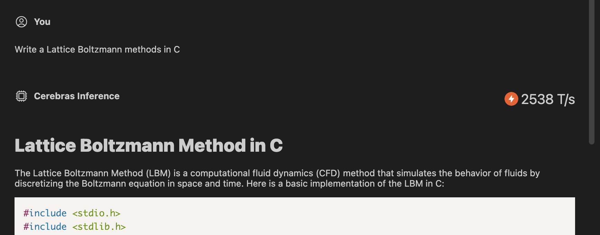

# WSCode

WSCode is an unofficial extension that enables you to chat with Cerebras Inference directly within VSCode.

## Features

- Directly chat with Cerebras Inference
- Switch between Llama 3.1 8B and Llama 3.3 70B models
- Provide currently open file or selected text to the context window

## Requirements

Get an API key from https://cloud.cerebras.ai/, then set it using `WSCode: Setup API Key for Cerebras Inference` command.

## Extension Settings

This extension contributes the following settings:

* `wscode.setupApiKey`: Setup API key.
* `wscode.ask`: Ask anything.

## Known Issues

The context window for your API key varies by tier and may be capped at 8192 tokens.
Large files could exceed this limit.
If that happens, open a blank file or select a relevant portion of the file to continue.

## Disclaimer

This is NOT an official extension. Cerebras Inference is a trademark of Cerebras Systems Inc.
